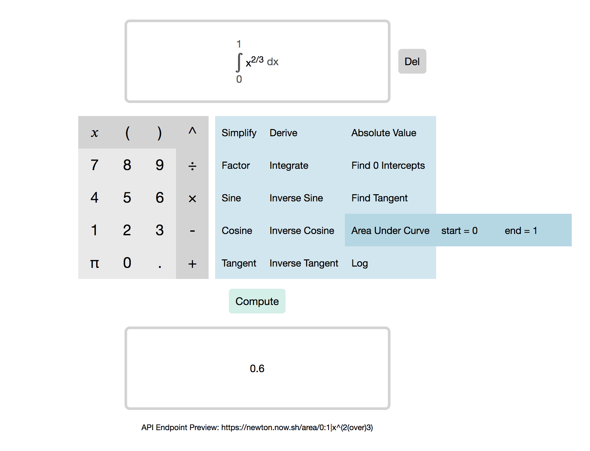

# My Simple Math App

[Live](https://keon-choi-math-app.herokuapp.com/)

Execute simple math operations from factoring to integration using [aunyks newton-api](https://github.com/aunyks/newton-api).

## How To Use
  1. Select one of the operations displayed on the dashboard.  
  (Some operations require extra paramters i.e, start and end points for area under a curve)  
  2. Input your expression, you should see them appear at the top preview.  
  3. Click "Compute" to see the results.

## Features
  * Includes all operations newton-api provides
  * Parses user input to render expressions in "pretty" format
  * Encodes the user input into a url GET request to newton-api

## UI/UX

